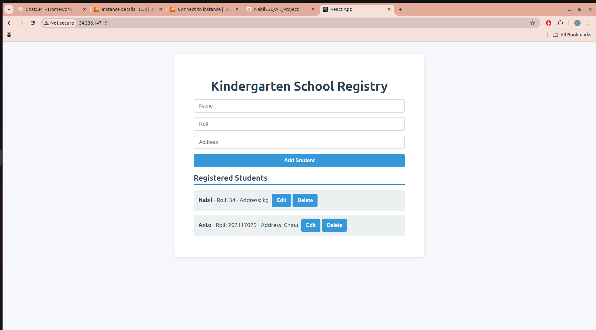
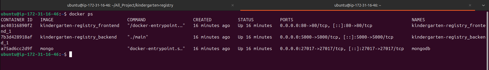
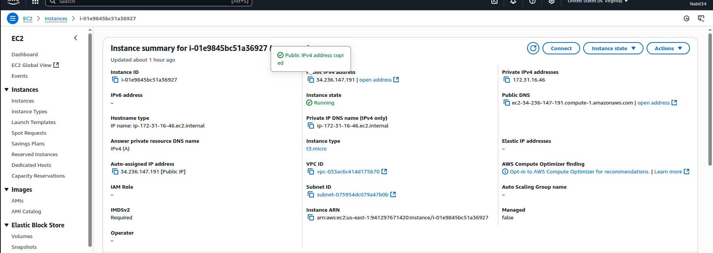

# Linux based hosting

## Kindergarten Registry — React + Go + MongoDB (Deployed with Nginx)

This project is a Kindergarten Registry Management System built using React (frontend), Go (backend), and MongoDB (database).  
It is deployed on an AWS EC2 (Ubuntu t3.micro) instance using Nginx as a reverse proxy.

---

## Project Structure

All_Project/
├── kindergarten-registry/
│ ├── backend/ # Go server (API)
│ ├── frontend/ # React application
│ ├── docker-compose.yml # MongoDB service


---


## Step-by-Step Deployment Guide

### Launch EC2 Instance
1. Create an EC2 instance using **Ubuntu 22.04 (t3.micro)**.  
2.  Connect via SSH:
   ```bash
   ssh -i key.pem ubuntu@<EC2_PUBLIC_IP>
```

###  Clone the Repository
```
cd ~
git clone https://github.com/Nabil720/All_Project.git
```

### Install Required Packages
```
sudo apt update && sudo apt upgrade -y
sudo apt install -y nginx docker.io docker-compose nodejs npm golang-go

# Verify
nginx -v
docker -v
go version
node -v
```
### Set Up MongoDB
```
cd All_Project/kindergarten-registry
nano docker-compose.yml

version: '3.8'

services:
  mongo:
    image: mongo
    container_name: mongo
    restart: unless-stopped
    ports:
      - "27017:27017"
    volumes:
      - mongo_data:/data/db

volumes:
  mongo_data:

# Run MongoDB
docker-compose up -d

```

### Setup and Run Backend and Frontend
```
cd backend
go mod init backend
go mod tidy
go run main.go

cd ../frontend
npm install
npm run build
```

### Configure Nginx
```
# Backup default configuration
sudo mv /etc/nginx/sites-available/default /etc/nginx/sites-available/default.bak

# Create a new config file
sudo nano /etc/nginx/sites-available/kindergarten.conf

server {
    listen 80;
    server_name 34.236.155.125;

    root /home/ubuntu/All_Project/kindergarten-registry/frontend/build;
    index index.html;

    location / {
        try_files $uri /index.html;
    }

    location /api/ {
        proxy_pass http://localhost:5000/;
        proxy_http_version 1.1;
        proxy_set_header Upgrade $http_upgrade;
        proxy_set_header Connection 'upgrade';
        proxy_set_header Host $host;
        proxy_cache_bypass $http_upgrade;
    }
}


# Enable the configuration and restart Nginx
sudo ln -s /etc/nginx/sites-available/kindergarten.conf /etc/nginx/sites-enabled/
sudo nginx -t
sudo systemctl restart nginx
sudo systemctl enable nginx
```

### Fix File Permissions
```
sudo chmod -R 755 /home/ubuntu/All_Project/kindergarten-registry/frontend/build
sudo chmod +x /home/ubuntu
sudo chmod +x /home/ubuntu/All_Project
sudo chmod +x /home/ubuntu/All_Project/kindergarten-registry
sudo chmod +x /home/ubuntu/All_Project/kindergarten-registry/frontend
sudo systemctl reload nginx
```

### Access the Application
```
http://34.236.155.125

```


-----------------------------------------------------------------------------------------------------------------


# Docker based hosting

## Kindergarten Registry

A full-stack React + Node.js + MongoDB application deployed using Docker.

All_Project/
└── kindergarten-registry/
    ├── backend/          # Node.js/Express backend
    ├── frontend/         # React frontend
    │   ├── build/        # Production build (generated)
    │   └── nginx.conf    # Nginx reverse proxy config
    └── docker-compose.yml


### nginx.conf
```
server {
    listen 80;

    server_name _;

    root /usr/share/nginx/html;
    index index.html index.htm;

    # React SPA routing
    location / {
        try_files $uri /index.html;
    }

    # Backend API reverse proxy
    location /api/ {
        proxy_pass http://backend:5000/;
        proxy_http_version 1.1;
        proxy_set_header Upgrade $http_upgrade;
        proxy_set_header Connection 'upgrade';
        proxy_set_header Host $host;
        proxy_cache_bypass $http_upgrade;
    }
}
```
## frontend/Dockerfile
```

FROM nginx:alpine

COPY build/ /usr/share/nginx/html

COPY nginx.conf /etc/nginx/conf.d/default.conf

EXPOSE 80

CMD ["nginx", "-g", "daemon off;"]
```

## Setup & Installation

1. Clone the repository

```bash
git clone https://github.com/Nabil720/All_Project.git
cd All_Project/kindergarten-registry
```
2. Update system and install dependencies

```
sudo apt update -y
sudo apt upgrade -y
sudo apt install docker.io docker-compose -y
sudo systemctl start docker
sudo systemctl enable docker
sudo usermod -aG docker $USER
newgrp docker
```

3. Build frontend

```
cd frontend
npm install
npm run build
```

docker-compose up -d











------------------------------------------------------------------------------------------------------------